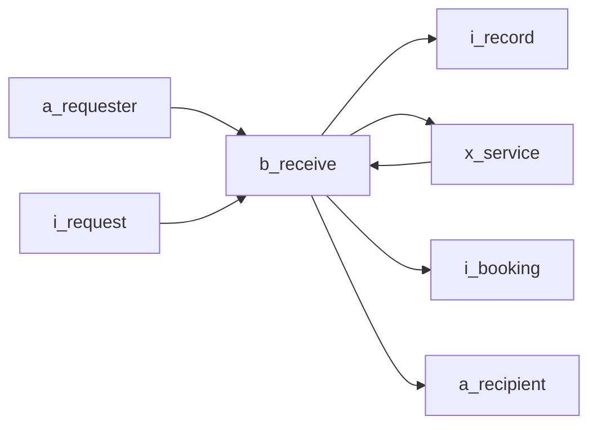

# Mermaid icon context conventions

## Visual invariant

The icon is the visual object. Its size does not depend on its label.

```mermaid
a_customer@{ label: "依頼者", img: "https://raw.githubusercontent.com/maakbo/fde/main/assets/icons/lucide-thin/user.svg", pos: "b", w: 38, h: 38, constraint: "on" }
```

## Scope and direction

- Keep one subject and one relationship meaning.
- Start focused views with 3–7 nodes and up to 9 relationships.
- Use `--allow-complexity` only after recognizing a larger view as intentional observation.
- Use `flowchart TB` or `flowchart LR` for layout, independently of line direction.
- Use `---` for ordinary business relationships. Use `-->` only when a strong dependency is an intentional part of the question; do not turn every relationship into an arrow.
- If input/output value handoff itself is the question, make that explicit as a value-flow context and use arrows there. Arrows still do not mean a detailed procedure.

## Context ladder profiles

Use the profile that matches the question; do not make one figure carry every
level at once.

| Profile | Center | Include |
| --- | --- | --- |
| Overall context | A title-level business area or outcome as a `b_` anchor | Major actor subjects; keep detailed information and systems for child views |
| Use-case / scene context | One outcome-sized `b_` activity | The `a_`, `x_`, and `i_` elements whose responsibility, boundary, handoff, or value changes in that scene |
| Complexity observation | The current same-level backbone | All useful candidates when the density itself needs to be seen; acknowledge it with `--allow-complexity` |

The next rung after a use-case context is a business flow, which belongs to the
business-flow profile and uses arrows for order. When several scene contexts are
needed, link each one to its single parent overview node in the model-set index.

## Node IDs and icons

Use stable `prefix_lower_snake_case` IDs.

| Prefix | Meaning | Thin Lucide asset | Size |
| --- | --- | --- | --- |
| `a_` | actor | `lucide-thin/user.svg` | `38 x 38` |
| `b_` | business activity | `lucide-thin/ellipse.svg` | `30 x 30` |
| `i_` | information | `lucide-thin/file.svg` | `32 x 32` |
| `x_` | external system | `lucide-thin/server.svg` | `32 x 32` |
| `v_` | device or contact surface | Thin Lucide device asset | `38 x 38` |

Use this raw asset base in Mermaid nodes:
`https://raw.githubusercontent.com/maakbo/fde/main/assets/icons/lucide-thin/`

The assets preserve Lucide geometry and normalize the shared stroke width to
`1.35`. Do not switch back to standard Iconify Lucide URLs: their embedded
`stroke-width` is `2`, so a Mermaid stylesheet cannot make the external SVG
thinner consistently.

Device URLs:

- iPad: `lucide-thin/tablet.svg`
- iPhone: `lucide-thin/smartphone.svg`
- laptop: `lucide-thin/laptop.svg`

Keep node properties in this exact order: `label`, `img`, `pos`, `w`, `h`,
`constraint`. Keeping the English ID immediately next to the Japanese label
makes renaming and consistency checks easier. Keep one node per line.

The source canvas is square because Mermaid v11 sizes image nodes from the height property. The business ellipse stays at `30 x 30`; information and external-system icons use `32 x 32` so their visible geometry stays close to the actor and business marks without overpowering them. Actors and devices remain `38 x 38` because their Lucide geometry needs the taller canvas. Use `nodeSpacing: 64` and `rankSpacing: 80` so relationship paths have roughly one-character breathing room around the icon field.

Lift only the business label by `6px` with `margin-top` to compensate for the ellipse icon's transparent lower canvas. Avoid CSS transforms on the HTML label inside Mermaid's SVG `foreignObject`: some GitHub/browser combinations can move that label outside its node. The canonical CSS selects Mermaid image-node IDs containing the stable `-flowchart-b_` prefix because Mermaid does not preserve `class` statement names on image-node DOM elements. Do not shift labels for actors, information, systems, or devices.

The canonical CSS gives only Mermaid's first, icon-sized transparent image-boundary path a `10px` white stroke. This masks the last few pixels of a relation path and creates a stable visual gap between the line and the icon without shrinking the icon or covering the label boundary. The `g:first-child` selector follows Mermaid v11.16's image-node structure and survives Mermaid's themeCSS sanitizer; re-render and inspect all previews whenever Mermaid is upgraded. Keep this rule paired with the white background token; if the background changes, change both together.

## Labels

- Use short nouns for actors, information, and systems.
- Use one outcome-oriented verb phrase for activities.
- Prefer 1–4 words or no more than 8 Japanese characters.
- Do not use sentences, line breaks, parentheses, or step numbers.

## Relationships and style

For a relationship context, use undecorated undirected relationships by default:

```mermaid
a_customer --- b_receive
```

Do not use arrows, edge labels, multiple weights, visible node boxes, or color hierarchy between equivalent nodes. Replace one `---` with `-->` only when the arrow is needed to call out a strong dependency.
Do not write both `node_a --- node_b` and `node_b --- node_a`; an undirected
line already represents both directions.

For an input/output value context, use a left-to-right backbone and solid arrows:



Keep the business activity at the center of the value view. Every edge should join that activity to an actor, information item, or external system. Use no edge labels unless the label is the only way to name an exchange; the node labels should carry the value meaning. Keep actors who provide the input and receive the output in the same view. This value-flow profile is an explicit exception to the ordinary relationship-line default.

## Master map exception

An actor, external-system, or information master map intentionally connects
same-type nodes. In that profile, `---` means an undirected structural relation
and `-->` means a deliberate hierarchy, integration, derivation, or dependency
direction as defined by the map's reading sentence. These arrows are not a
business-process sequence. Read
`../business-context-modeling/references/master-elements.md` and use the
matching master template and checker; do not apply this exception to a
business-centered context view.

Use the template colors, 14px font, `diagramPadding: 40`, and a `0.75px` relation line or arrow. The outer padding prevents labels on edge nodes from being clipped without enlarging the icons. Keep source order: frontmatter, flowchart declaration, nodes, relationships, classes, class definitions, link style.

## Working-source compatibility

Keep the repository's thin Lucide raw URLs in the Mermaid block. The geometry remains Lucide and the shared stroke width is `1.35`. Default to a Markdown working file so GitHub or VS Code can preview the same source being discussed. A preview engine must support Mermaid v11 image nodes and remote SVG URLs; if it does not, keep editing the source and use `mermaid-diagram-export` only when the user explicitly needs stable media assets.
