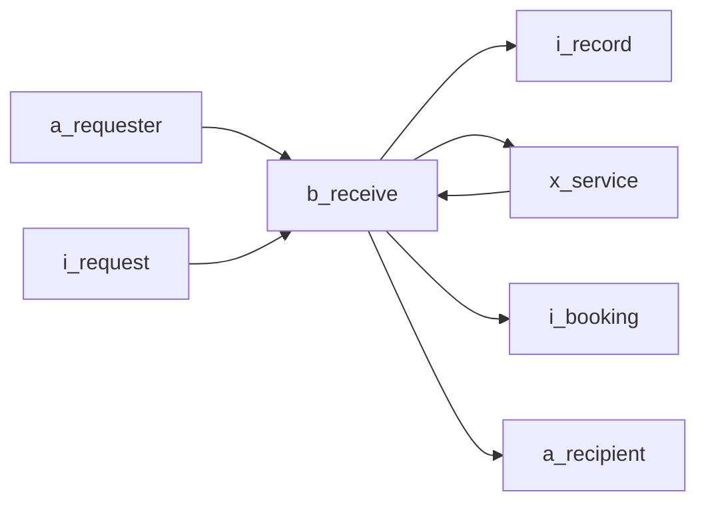

# Mermaid icon context conventions

## Visual invariant

The icon is the visual object. Its size does not depend on its label.

```mermaid
a_customer@{ img: "https://raw.githubusercontent.com/maakbo/fde/main/assets/icons/lucide-thin/user.svg", label: "依頼者", pos: "b", w: 38, h: 38, constraint: "on" }
```

## Scope and direction

- Keep one subject and one relationship meaning.
- Start focused views with 3–7 nodes and up to 9 relationships.
- Use `--allow-complexity` only after recognizing a larger view as intentional observation.
- Use `flowchart LR` when input/output value relationships are the question; use `flowchart TB` when only undirected business relationships matter.
- In a value-flow context, arrows mean value or information handoff, not elapsed time or a detailed procedure.

## Node IDs and icons

Use stable `prefix_lower_snake_case` IDs.

| Prefix | Meaning | Thin Lucide asset | Size |
| --- | --- | --- | --- |
| `a_` | actor | `lucide-thin/user.svg` | `38 x 38` |
| `b_` | business activity | `lucide-thin/ellipse.svg` | `30 x 30` |
| `i_` | information | `lucide-thin/file.svg` | `38 x 38` |
| `x_` | external system | `lucide-thin/server.svg` | `38 x 38` |
| `v_` | device or contact surface | Thin Lucide device asset | `38 x 38` |

Use this raw asset base in Mermaid nodes:
`https://raw.githubusercontent.com/maakbo/fde/main/assets/icons/lucide-thin/`

The assets preserve Lucide geometry and normalize the shared stroke width to
`1.35`. Do not switch back to standard Iconify Lucide URLs: their embedded
`stroke-width` is `2`, so a Mermaid stylesheet cannot make the external SVG
thinner consistently.

Device URLs:

- iPad: `lucide-thin/tablet.svg`
- iPhone: `lucide-thin/smartphone.svg`
- laptop: `lucide-thin/laptop.svg`

Keep node properties in this exact order: `img`, `label`, `pos`, `w`, `h`, `constraint`. Keep one node per line.

The source canvas is square because Mermaid v11 sizes image nodes from the height property. At `30 x 30`, the Lucide path remains a horizontal ellipse with enough visual presence to carry the business subject while staying quieter than the `38 x 38` supporting icons.

Lift only the business label by `6px` with `margin-top` to compensate for the ellipse icon's transparent lower canvas. Avoid CSS transforms on the HTML label inside Mermaid's SVG `foreignObject`: some GitHub/browser combinations can move that label outside its node. The canonical CSS selects Mermaid image-node IDs containing the stable `-flowchart-b_` prefix because Mermaid does not preserve `class` statement names on image-node DOM elements. Do not shift labels for actors, information, systems, or devices.

## Labels

- Use short nouns for actors, information, and systems.
- Use one outcome-oriented verb phrase for activities.
- Prefer 1–4 words or no more than 8 Japanese characters.
- Do not use sentences, line breaks, parentheses, or step numbers.

## Relationships and style

For a relationship context where direction is not part of the question, use undecorated undirected relationships:

```mermaid
a_customer --- b_receive
```

Do not use arrows, edge labels, multiple weights, visible node boxes, or color hierarchy between equivalent nodes.

For an input/output value context, use a left-to-right backbone and solid arrows:



Keep the business activity at the center of the value view. Every edge should join that activity to an actor, information item, or external system. Use no edge labels unless the label is the only way to name an exchange; the node labels should carry the value meaning. Keep actors who provide the input and receive the output in the same view.

Use the template colors, 14px font, `diagramPadding: 40`, and a `0.75px` relation line or arrow. The outer padding prevents labels on edge nodes from being clipped without enlarging the icons. Keep source order: frontmatter, flowchart declaration, nodes, relationships, classes, class definitions, link style.

## Working-source compatibility

Keep the repository's thin Lucide raw URLs in the Mermaid block. The geometry remains Lucide and the shared stroke width is `1.35`. Default to a Markdown working file so GitHub or VS Code can preview the same source being discussed. A preview engine must support Mermaid v11 image nodes and remote SVG URLs; if it does not, keep editing the source and use `mermaid-diagram-export` only when the user explicitly needs stable media assets.
