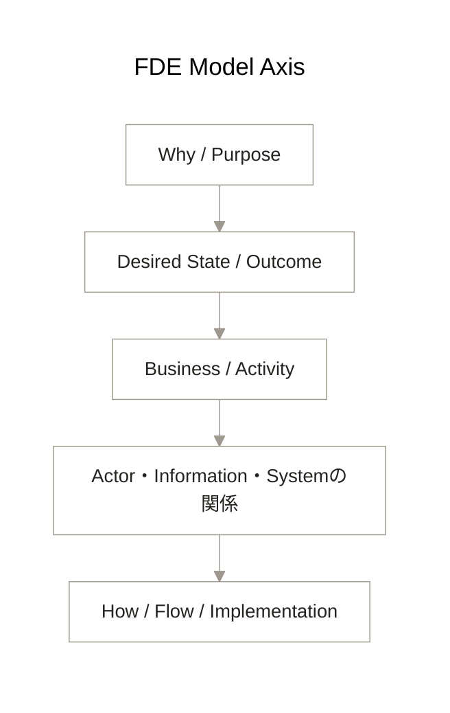

# FDE Model Axis — WhyからHowまで

## Modeling question

Howを、どのWhy、状態、Business、関係のために選んだのかを、変化後も辿れるようにするには何をModelへ残すか。

## Reading

上から下へ、WhyをHowへ具体化する意味のつながりを読む。矢印は一方向のwaterfallや固定工程ではなく、下位Modelを評価するときに遡る意味の軸を表す。

## Round trip

詳細なHowを作った結果、Whyを満たせない、Businessの切り方が違う、Actorの意味や責務が違うと分かったら、該当する上位Modelへ戻して修正する。上位の意味が曖昧なら下位へ降りて具体で確かめ、具体で得た区別は再び上位へ戻す。

Modelは固定された正解ではない。

> 変化しても戻ってこられる意味の軸

Howだけを残すと、技術、System、環境が変わったときに古くなりやすい。Why / What / Whoと意味関係が残っていれば、何を守り、何を変えてよいかを判断し、新しいHowを設計し直せる。
