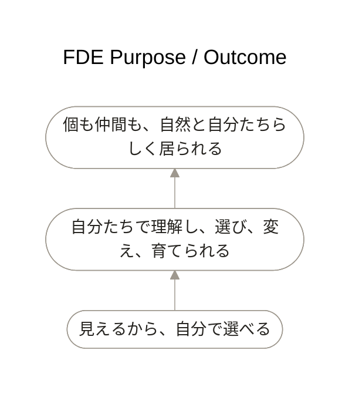

# FDE Purpose / Outcome — working hypothesis

## Modeling question

FDEは何のために存在し、どの状態変化を目指すのか。

## Reading

下から上へ、可視化・モデリングによるEnabling Outcomeが主体者たちのDesired Stateを支え、その状態がUltimate Purposeへつながる、と読む。三つは同じPurposeではない。

## Meaning

- **Ultimate Purpose**: `個も仲間も、自然と自分たちらしく居られる`。人、AI Agent、Systemなどが同じ形に揃えられるのではなく、違いを失わず、役割と居場所を持ち、無理なく関係し、自律しながら協働できる状態を含む。
- **Desired State**: 主体者と仲間が業務の仕組みを自然に理解し、自分たちで判断し、選び、変え、育て続けられる。`fde`へ恒久的に依存しない。
- **Enabling Outcome**: `見えるから、自分で選べる`。可視化・モデリングによって生み出す重要なOutcomeであり、FDE全体のUltimate Purposeではない。

矢印は時間順序ではなく、下位の状態が上位の状態を可能にする意味関係を表す。

## Status

三つのstatementと関係はworking hypothesisである。特にUltimate Purposeは、意味を確定したtaglineとしてではなく、FDE sampleで検証する。
