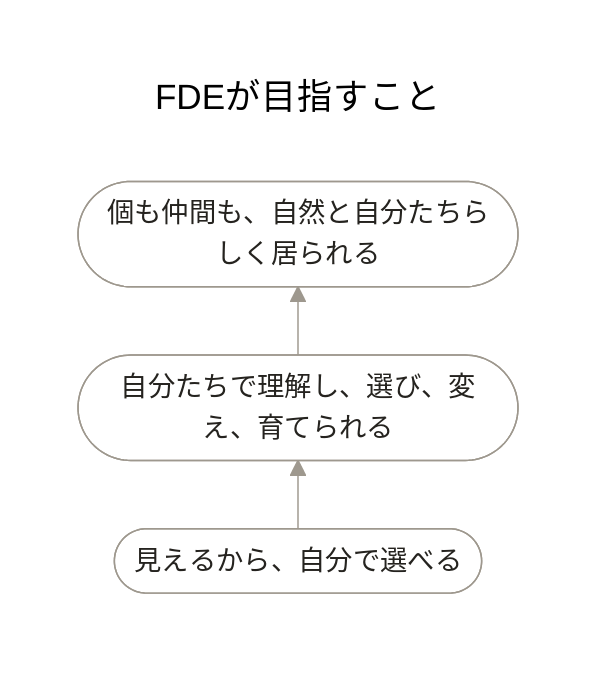

# FDEが目指すこと

見えることは、ゴールではありません。自分たちで理解し、選び、変え、育てられる状態を支えます。

## モデル

## このモデルが表していること

業務が見えると、自分たちで選べるようになります。その理解を手元に残すことで、仕組みを自分たちで変え、育てていけます。

その先に、個も仲間も、それぞれの違いを失わず、自然と自分たちらしく居られる状態を目指します。

← [FDEの全体へ](README.md)

[誰と実現するかを見る](system-context.md) →
