# Repair intake — working model

## Modeling question

How does a repair request become a bookable repair without hiding missing-information rework?

- Reader: customer-support and repair-operations participants.
- Boundary: repair intake, before physical repair begins.
- State: current-state synthetic example.
- Context reading: each line connects an actor, information item, or outside service to the repair-intake activity that gives the relationship business meaning.
- Flow reading: read from receiving a request to booking the repair, following the labeled decision branches.

## Candidate inventory

- Actors: customer; intake coordinator.
- Business activities: receive repair request; request missing details; book repair.
- Information: repair request; intake record; booking.
- External systems: scheduling service.
- Implementation details omitted from the first model: email channel; form fields; notification mechanism.
- Unresolved: whether the intake coordinator must appear as an actor depends on whether internal responsibility is part of the discussion.

## Selected views

- [Overview source](overview.mmd) · [SVG](overview.svg) · [PNG](overview.png)
- [Context source](context.mmd) · [SVG](context.svg) · [PNG](context.png)
- [Flow source](flow.mmd) · [SVG](flow.svg) · [PNG](flow.png)
- [Model-set trace](model-set-index.md)

## Text alternative

The customer, repair request, intake record, and external scheduling service relate through receiving the repair request. The flow receives the request, checks completeness, requests details and rechecks when information is missing, then books the repair.

The overview places intake before repair and return. The context expands the stable overview node `b_manage_intake`; the detailed flow expands `b_receive_request` inside that context. If detailed intake work reveals that booking belongs to repair execution rather than intake, revise the boundary upward in the overview.

## Assumptions and omissions

- The scheduling service is outside the selected repair-intake responsibility boundary.
- Booking is shown in the flow but omitted from the context foundation to keep the first relationship question focused.
- The example does not assert which channel carries missing-detail requests.

## Next discussion question

Does checking completeness belong inside `Receive request`, or is it a separate responsibility with a meaningful business outcome?
